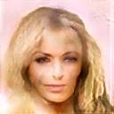
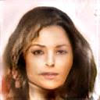
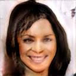
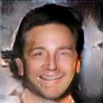

Generating realistic looking human face images aligned with natural language descriptions using modified version of NVidia's StyleGAN.

Some examples:
1) A young girl with straight long blonde hair . Her eyes are brown and small and her lips are thin . She has got a heavy lower lip . She looks serious .  

2) A young girl with straight long dark hair . Her eyes are brown and small and her lips are thin . She has got a heavy lower lip . She looks serious .  

3) A young girl with straight long dark hair . Her eyes are brown and small and her lips are thin . She has got a heavy lower lip . She is smiling and her upper teeth is visible .  

4) A man with a chiselled jaw . He has narrow eyes and short , curly , black hair . He is smiling .  

# TODO: 
- Links for required data files.
