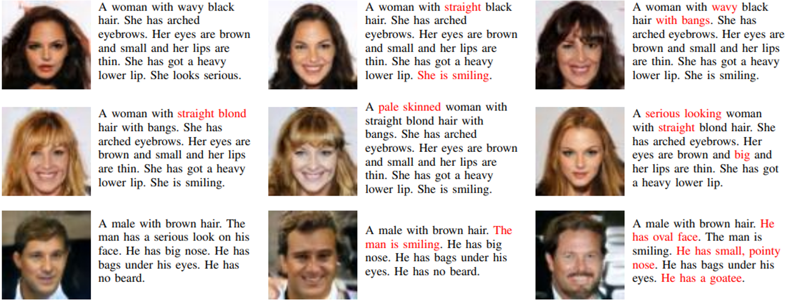

Generating realistic looking human face images aligned with natural language descriptions using modified version of NVidia's StyleGAN.

Some examples generated by network (descriptions omitted).

Some examples with descriptions. Changes in descriptions are marked as red. Note how generated image changes according to given description.

More than one image can be generated with given description by changing noise in intermediate layers:

3D models generated from 2D images:

